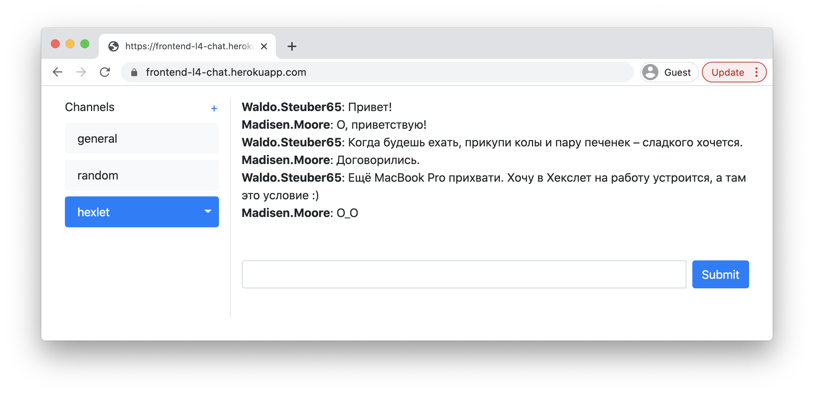
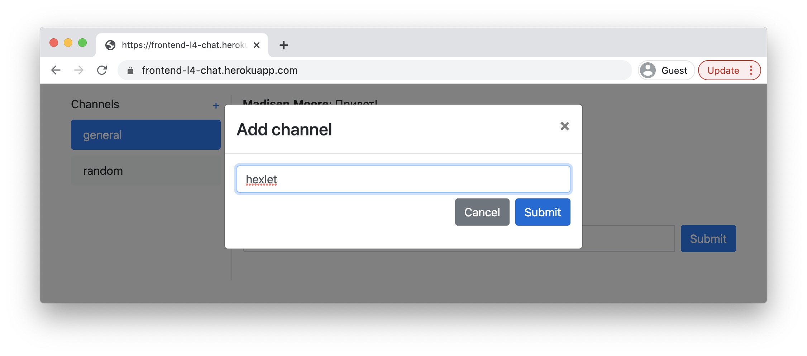

### Hexlet tests and linter status:
[](https://github.com/Julia-Tisa/frontend-project-12/actions)
[](https://codeclimate.com/github/Julia-Tisa/frontend-project-12/maintainability)

## SetUp
```
make install
```
## Starting the web server
```
make start
```
## Exit from web server
```
The command in the terminal: control + C
```

## URL of app:
https://frontend-project-12-production-afa4.up.railway.app

## Project description:
A simple and user-friendly chat was created using React and Node.js. The project allows users to send messages in real-time. Socket.IO library was used for implementing real-time functionality and React was used for building the user interface. The project also includes a user authentication system. In addition to the real-time sending feature, the project also provides a simple yet modern user interface, making it easy for users to navigate and interact with the chat.


